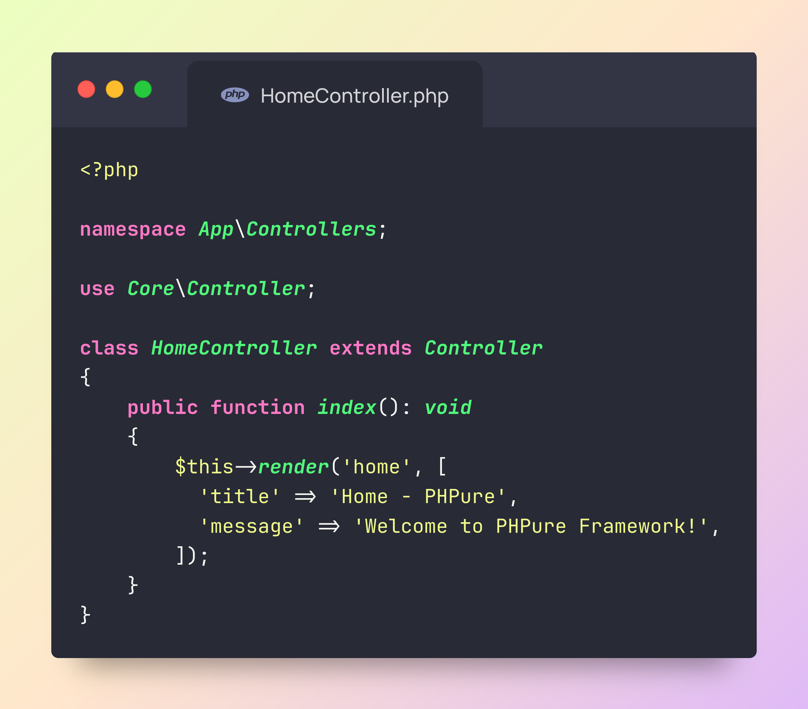

<p align="center">
  
</p>

<h1 align="center">PHPure Framework</h1>

<p align="center">
  <a href="https://opensource.org/licenses/MIT"></a>
  <a href="https://packagist.org/packages/mttk2004/phpure"></a>
  <a href="https://packagist.org/packages/mttk2004/phpure"></a>
  <a href="https://php.net">=8.0"></a>
</p>

<p align="center">A lightweight, pure PHP framework inspired by Laravel, designed to help beginners learn and understand how web applications work with the MVC pattern.</p>

---

## 📋 Overview

PHPure provides a clean, simple, and elegant structure to build PHP applications. It includes essential features like routing, database ORM, template engine, middleware, validation, and more, while keeping the codebase easy to understand and maintain.

This framework is perfect for:

- ✅ Learning the MVC architecture
- ✅ Understanding how web frameworks work under the hood
- ✅ Building small to medium-sized applications
- ✅ Gaining a solid foundation before moving to larger frameworks like Laravel

## 🚀 Quick Start

```bash
# Create a new PHPure project
composer create-project mttk2004/phpure project_name
cd project_name

# Install dependencies
npm install

# Configure your environment
cp .env.example .env

# Run the development server
npm run dev:all
```

Open http://localhost:8000 to see the result!

## 📚 Documentation

Detailed documentation is available in the [Official PHPure Documentation](https://phpure.netlify.app).

## 🛠️ Key Features

- **MVC Architecture** - Clean separation of Models, Views, and Controllers
- **Routing System** - Simple and flexible routing
- **Database ORM** - Elegant database interactions
- **Template Engine** - Using Twig for powerful templating
- **Middleware** - Request/response filtering
- **Authentication** - Built-in authentication system

## 🔔 Notice

This project includes Twig, a template engine licensed under the BSD-3-Clause license, not MIT. All other components of PHPure are licensed under MIT.

## 📜 License

PHPure is open-source software licensed under the [MIT license](https://opensource.org/licenses/MIT).

## 👨‍💻 Author

Created by [Mai Trần Tuấn Kiệt](https://github.com/mttk2004).

## 🤝 Contributing

Contributions are always welcome! See [contributing guide](CONTRIBUTING.md) for more information.

---

<p align="center"><i>Last updated: April 2025</i></p>
